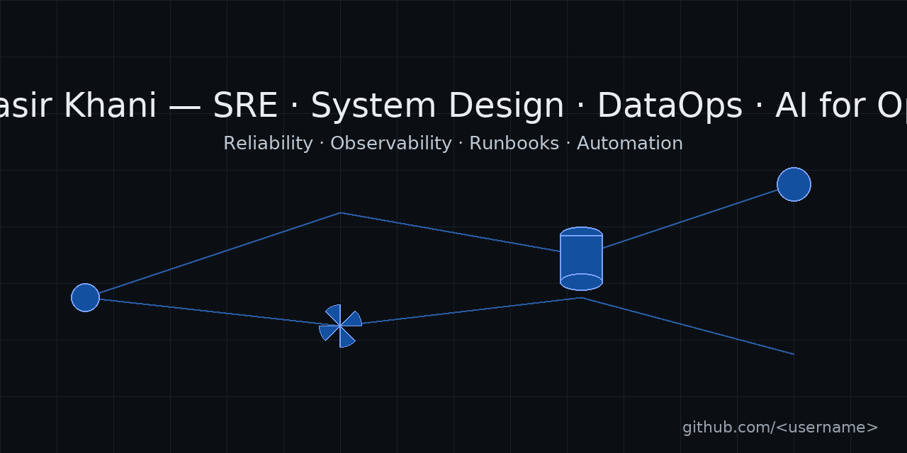

<h1 align="center">Nasir Khani — SRE · System Design · DataOps · AI for Ops</h1>

Reliability first · Operability · Observability · Automation

  

---

### Focus
- **SRE:** SLO/SLA management, incident response, safe change practices, runbooks.
- **DataOps:** log/metrics collection, simple and maintainable pipelines, data quality.
- **AI for Ops:** local models for log summarization and knowledge retrieval (air-gapped friendly).

### Selected work (pinned)
- **sre-lab-slos** — sample SLOs, error budget math, burn-rate alerts, Grafana dashboard.
- **runbook-automation** — small, reliable scripts/DAGs for repetitive ops tasks (restart, health checks, log sweep).
- **obs-mini-stack** — Vector/Filebeat → ClickHouse → Grafana; quick queries for latency and error-rate.
- **postgres-ops-notes** — backup/restore, vacuum/ANALYZE checklist, minimal monitoring guidance.
- **zabbix-ruleset-examples** — example templates/triggers/discovery, severity mapping, basic correlation.
- **ai-ops-notebooks-lite** — lightweight notebooks for local log summarization; before/after examples.

### How I work
Trunk-based development, small PRs with tests, runbooks before on-call, concise docs people actually use.  
Security by default: CodeQL, secret scanning, Dependabot, signed commits, branch protection.

### Contact
📧 khani.nasir@gmail.com  
🌐 <www.linkedin.com/in/nasirkhani>

---

  
  
  

